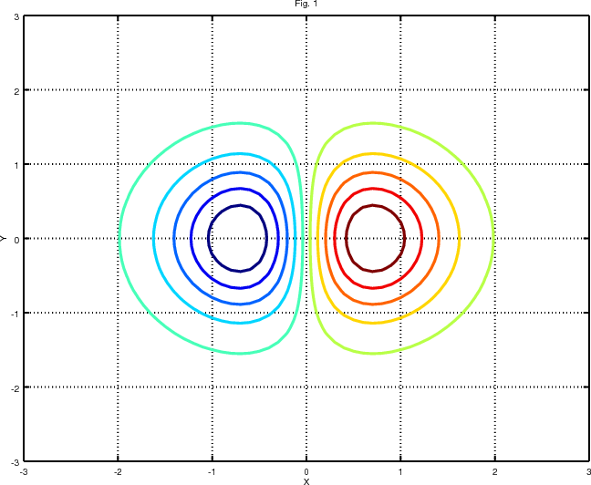
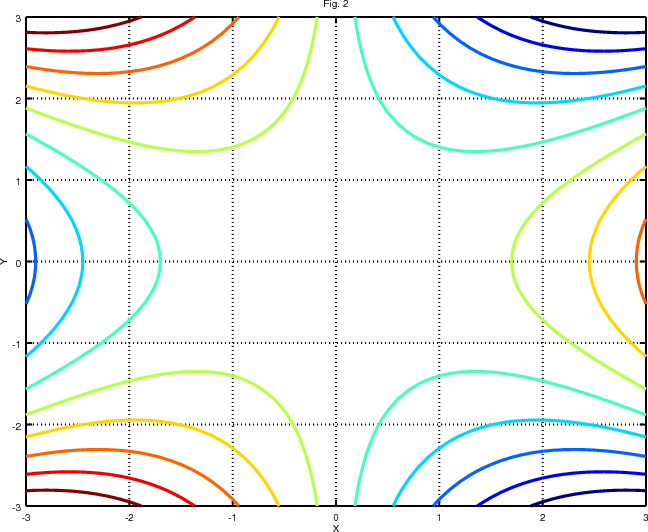
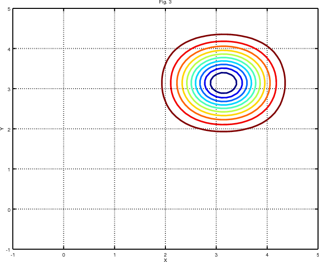

# Introduction
The context of using Simulated Annealing in this experiment is to perform a research of the global minimum for some funtions of two variables. It is the nature of these functions that makes them easy to be imagined and perceived as landscapes. Another good reason is the dimensionality of the problem. As I am going to show later, it is by handling this class of functions that one realises how huge the research space can be; even by limiting it to a small interval like [-3,3] on both axes, there are cases when the number of iterations needed until convergence can reach easily the order of thousands.
Finally, I have also found some two dimensional examples which show the limits of the Simulated Annealing approach. The algorithm cannot perform its task whenever the region containing the global minima is small and any path leading to it is not smooth enough [1](#References).

# Background
Simulated Annealing, as the name may suggest, is a term coming from thermodynamics. The basic idea consists in applying the same principles of the annealing process to the research of the global minima. The problem it tries to solve is to allow the research method to "move on" from a local minimum point, hence accept a less favourable move with a certain probability given by the formula:

$$ P = e^{-\dfrac{\Delta E}{T}} $$

The basic idea is to compare the probability P with a random value [0,1) from a uniform distribution in order to determine whether the probability to be on the right path [P] is better than a random search U(0,1). As long as the value of T is high, the system is inclined to accept most of the "bad" moves, since they have a good probability to succeed. As T decreases, less unfavourable moves will be accepted. Eventually the research is expected to converge to a suboptimal solution.
The other quantities involved are:

* E the energy. In our case E represents the value of the function in a specific point $E(x,y)$. $\Delta E$ represents the difference of value in two neighbour points of the function.
* T the temperature. In practice it is a counter of the iterations. T is typically initialised at a high value and decreased step-by-step by following a certain schedule. The schedule policy is typically obtained by multiplying the previous value by a factor $\alpha$ which needs to be determined. Other policies exist, but their common characteristic is the very slow convergence.

At the begining of each iteration, Temperature is compared to $\varepsilon$ in order to establish the primary stopping criteria. The temperature will diminish at the end of each cycle by following the schedule parameter $0 < \alpha < 1$. We also need a second stopping criteria -- the temperature is set to a very high value, so in some cases, there is no need to use all the possible iterations. In [1,2](#References) it is suggested to keep track of the number of transitions and to define a threshold level as a stopping criteria. In this implementation, there is a case when a move from the current point is not accepted -- either because it does not improve the situation or the probability to improve is scarce. Furthermore, I had noticed that in case of convergence, there would be no other transition from the current point, therefore, this looks like a good condition to end the loop. The threshold number of rejected transitions is set to 20. This value appears to be big enough, in order to evaluate the move in each of the eight possible directions at least once.

# Experiments
The implementation of SA has been tested towards three different functions. The aim was to evaluate its performance in different settings, for instance:

* In a smooth surface example. This is the kind of situation mentioned in [1](#References). The function being used is $ f(x,y) = xe^{-x^2-y^2} $
* In a smooth surface which contains critical points. The function being used for this purpose is $ f(x,y) = x^3 - 3xy^2 $.
* In a vast area of research where the global minimum is located in a very small region. The path to the global minimum contains sharp edges. It represents a very difficult problem and the algorithm is more likely to fail in this scenario. The function used for this test is
$ f(x,y) = -\cos x \cos y \exp{(-(x - \pi)^2 - (y - \pi)^2)} $

Generally speaking, the success of the algorithm is going to depend on the dimensions of the domain and the initial temperature $T_0$. A high value is necessary in order to allow the necessary number of transitions from any starting point. In order to carry on my tests I have set $T_0 = 10E^9$. This value seems to be appropriate for most of my tests and an empirical evaluation appears to be the only way to determine its value.

In order to have a reasonable research dimension and accuracy of the result, both axes will contain a value for steps of size 0.1 in each direction. For instance, to the space [-3,3] will correspond a matrix of 60x60 elements.

### Smooth Surface
This function has a global minimum [-0.4218] at the point (x,y) = (0,-0.7). The level lines are shown in Fig. 1.

| Domain | Avg. Iterations | Convergence | Success Rate |
|---|---|---|---|
|$[-10,10]$ | 5847.5 | 02/30 | 7% |
|$[ -3, 3]$ | 5801 | 23/30 | 77\% |

I will continue illustrating the test results in small domains from this point onward. I have done several tests during development and testing phase with little success or no success at all in the interval [-10, 10] for this number of iterations [Temperature].

### Saddle Surface
This function has two global minimum points [-54] at coordinates (3,3) and (3,-3) in the same domain [-3,3]. It also contains a critical point with coordinates (-3,0). The level lines are shown in Fig 2. The critical point is located at the border of the domain.

| Domain | Avg. Iterations | Convergence | Success Rate |
|---|---|---|---|
|$[ -3, 3]$ | 4859.5 | 16/30 | 53% |

As can be seen from the table above the algorithm succeeded to find the minimum 16/30. With reference to the other 14 attempts: 5/14 (17\% of total) a suboptimal point was found. 9/14 (30\% of total) the algorithm stopped at the local minimum [-27]. This, I happens due to the random choice of the initial point.
If temperature is too low, any move from the local minimum will be rejected, otherwise the algorithm will search in the neighbourhood of the local minimum.

### Epsom Function
This function has a global minimum [-1] at coordinates $(-\pi,\pi)$ which is concentrated in a very small region. The rest of the surface is almost flat with numerous local minima. This function has been evaluated in the interval [-2,4] so that the global minimum would be included in the research area. The level lines are shown in Fig 3.

| Domain | Avg. Iterations | Convergence | Success Rate |
|---|---|---|---|
|$[ -2, 4]$ | 4864 | 0/30 | 0% 
|$[ -1, 5]$ | 4864 | 1/30 | 3%

In this case I run again the set of tests in the interval [-1,5]. The idea was to shift the solution somehow closer to the center. It converged just once at the global minimum, however, the research in this setting is expected to fail most of the time [2](#References).

|Smooth Surface|Monkey Saddle|Easom Function|
|:-:|:-:|:-:|
||||
|Fig. 1|Fig. 2|Fig. 3|

# Conclusions
The main thing to learn from this experience is the fact that whenever its conditions are met the algorithm guarantees convergence to the exact solution, which in this setting, is the minimum global point for a function of two variables. It is been demonstrated that its performance is yet better than an exhaustive search. Obviously, this result comes with a price and there are several pre conditions to evaluate before use.

**The problem**: As we saw in the case of the function 
$ f(x,y) = -\cos x \cos y \exp{(-(x - \pi)^2 - (y - \pi)^2)}$ one of the main conditions the algorithm requires is the smoothness of the surface. In presence of sharp edges and cliffs SA may face challenges to build a path towards the solution. Whereas is case of smooth surfaces the algorithm is guaranteed to perform well as shown in the example of $xe^{-x^2-y^2}$.

**The domain**: is another point to consider carefully. We have seen that even putting constraints and limiting the domain in a relatively small region [-10,10] on two dimensions, the space of research can be huge for SA, thus making the convergence more unlikely as the domain increases.

**The choice of initial temperature $T_0$**: It is understood that the initial temperature needs to be initialised to a very high value at the beginning. This quantity affects directly the number of iterations. $T_0$ is related to the number of points being polled -- each point needs to be polled several times during the execution of the algorithm. However, it appears that there is no plenty of advise regarding the setting of its maximum value. From various sources it appears that this value needs to be determined by empiric tests.

**The T schedule**: It represents the policy adopted for decreasing the value of T on each iteration. The schedule function is expected to ascertain that T decreases logarithmically with time [2](#References). In these set of tests an $\alpha = 0.995$ has been used in order to achieve a slow cooling policy. Once again this value has been determined as a trade-off between performance and accuracy. The suggested value of $\alpha$ for a suboptimal solution ranges between 0.85 and 0.96.

**Local minimum**: As can be seen in the example of the function $ f(x,y) = x^3 - 3xy^2 $ the possibility that the algorithm gets stuck in a local minima is still present. I believe that this is expected behaviour since SA acts as a probabilistic algorithm at the beginning and as a greedy algorithm towards the end of the iterations. So, it will depend on the precise time [temperature] to determine whether the algorithm will be able to escape a local minimum. For instance high temperature will return high probability to move to a less favourable point, and lower temperature will do the opposite.

# References
[1] Richard O. Duda, Peter E. Hart, David G. Stork
Pattern Classification

[2] K.L. Du, M.N.S. Swamy
Search and Optimization by Metaheuristics
